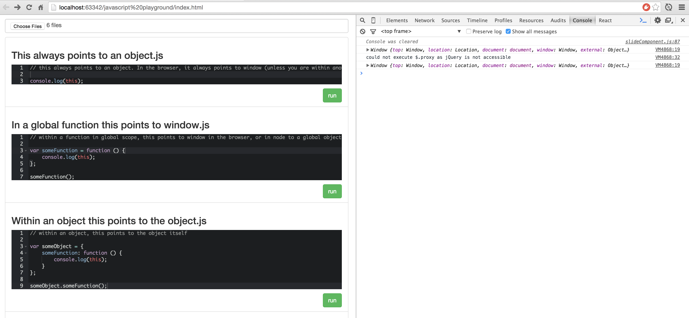

# javascript-playground

Playground for javascript, that allows you to upen javascript files and execute them (within an anonamous function) 
when clicking the run button. For presentation purposes, open your browser development console on the right to show 
console logs. Only tested in Chrome browser.

## Example

## Usage

* Install npm dependencies with `npm install`
* Listen for file changes using `npm start`

## Navigate using keyboard shortcuts:

After files uploaded:

* `up` + `down`: navigate through the uploaded code snippets
* `enter`: enter current selection. Focus editor
* `esc`: blur focus to current editor
* `ctr+r`: run current editor
